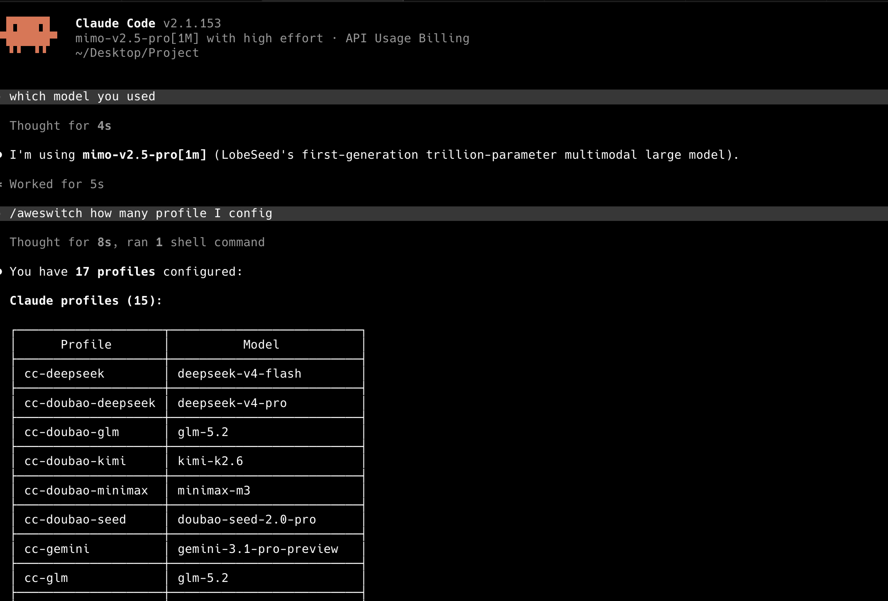
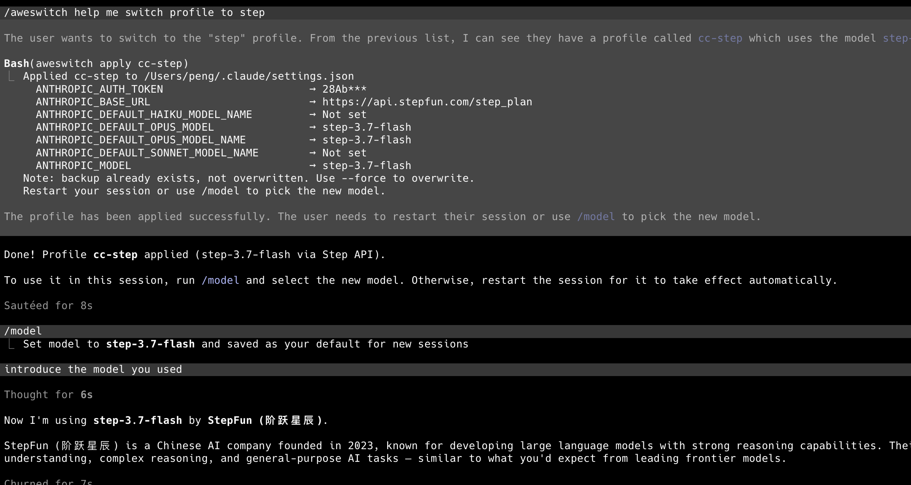

<div align="center">
  
  <h1>aweswitch: Agent Profile Switcher <a href="https://github.com/Webioinfo01/aweskill"></a></h1>
  <p><strong>一个很小的本地启动器，用来切换 AI agent 运行时 profile。</strong></p>
<p><strong>一份配置，一条命令 — Ubuntu、macOS、Windows 上用法一致。</strong></p>
  <p>用不同 API、token 和模型启动不同 agent 会话，同时不改写全局 agent 配置。</p>
  <p>
    <a href="./README.md">English</a> ·
    <strong>简体中文</strong> ·
    <a href="https://www.webioinfo.top/">Webioinfo</a>
  </p>
  <p>
    <a href="https://ko-fi.com/mugpeng"></a>
  </p>
  <p>
    
    
    
  </p>
  <p>
    
    
    
    
    
    
  </p>
</div>

> 让不同 agent profile 并行运行，同时不影响已经打开的会话。

`aweswitch` 从 `~/.config/aweswitch/config.json` 读取 profile，提供两种模式：

- **启动模式**（`aweswitch <profile>`）— 启动一个带独立 env 的新 agent 会话。每个会话有自己的 API endpoint、token 和模型。不同终端可以同时跑不同 profile。env 在启动时冻结。
- **写入模式**（`aweswitch apply <profile>`）— 把 profile 写入 agent 自己的配置成为持久默认：Claude env 写入 `~/.claude/settings.json`，Codex provider+model 写入 `~/.codex/config.toml`，OpenCode provider+模型列表写入 `~/.config/opencode/opencode.json`。不带参数的 `aweswitch apply` 一次应用全部 OpenCode profile。Claude 和 Codex 同一时间只有一个活跃默认。

它刻意保持小而直接。目前支持 Claude Code、Codex 和 OpenCode profile，以及官方帐号登录（Claude Code / Codex OAuth）。

## 支持工具

aweswitch 由两个配套工具驱动：

- **[aweskill](https://github.com/Webioinfo01/aweskill)** — 面向 AI agent 的 CLI skill 包管理器。负责 skill 的安装、更新和投影，支持 47+ 编程 agent。
- **[aweshelf](https://github.com/Webioinfo01/aweshelf)** — Claude Code 和 Codex 的会话 bookmark 管理器。可以保存、分类和恢复会话，支持 aweswitch profile。

aweswitch 管**启动**会话，aweshelf 管**记住**会话。用 `aweswitch -c` 在启动时自动 bookmark，用 `aweshelf resume` 恢复时会带上相同的 profile。

## 安装与使用

### 让 AI agent 安装和配置

如果你在 Claude Code、Codex、Cursor 等 coding agent 中工作，直接告诉它：

```text
Read https://github.com/Webioinfo01/aweswitch/blob/main/README.ai.md and follow it to install and configure aweswitch.
```

Agent 会安装 aweswitch、初始化配置、添加 profile，并帮你写入 settings。后续管理也可以通过 [aweskill](https://aweskill.webioinfo.top/) 安装 aweswitch skill。

**配置完成后你可以这样告诉 agent：**

> "把 cc-glm 写入 settings，这样我可以用 /model 切换。"
> "列出所有 aweswitch profile。"
> "添加一个 AiHubMix 的 codex profile。"
> "把 cc-glm 的 model 改成 glm-5.2。"

Agent 可以直接运行 `aweswitch apply`、`aweswitch config backup` 和 `aweswitch config restore`。

<details>
<summary>示例：查看已配置的 profile</summary>



</details>

<details>
<summary>示例：应用 profile 并切换模型</summary>



</details>


但不会运行 `aweswitch <profile>`（启动模式）— 那会导致 agent 嵌套。如果要启动 profile，在你自己的终端运行：

```bash
aweswitch cc-glm
```

### 手动安装和使用

从 PyPI 安装：

```bash
pip3 install aweswitch
aweswitch --help
```

创建默认配置并编辑：

```bash
aweswitch config init
aweswitch config edit
```

或者用交互方式添加 profile / 官方帐号：

```bash
aweswitch add
```

第一步选择类型：`api`（依次询问 provider、profile 名和各 provider 字段）或 `official`（交互式 OAuth 登录或导入 Claude Code / Codex 官方帐号）。

默认配置先按类型分组（`api` 为基于 env 的 API profile，`accounts` 为官方登录帐号），再按 provider 分组。以下是可以直接修改的参考配置：

```json
{
  "profiles": {
    "api": {
      "claude": {
        "cc-glm": {
          "env": {
            "ANTHROPIC_BASE_URL": "https://open.bigmodel.cn/api/anthropic",
            "ANTHROPIC_AUTH_TOKEN": "${GLM_ANTHROPIC_AUTH_TOKEN}",
            "ANTHROPIC_MODEL": "glm-5.1"
          }
        },
        "cc-xiaomi": {
          "env": {
            "ANTHROPIC_BASE_URL": "https://token-plan-sgp.xiaomimimo.com/anthropic",
            "ANTHROPIC_AUTH_TOKEN": "${XIAOMI_ANTHROPIC_AUTH_TOKEN}",
            "ANTHROPIC_MODEL": "mimo-v2.5-pro"
          }
        }
      },
      "codex": {
        "cx-openai": {
          "env": {
            "OPENAI_BASE_URL": "https://api.openai.com",
            "OPENAI_API_KEY": "${OPENAI_API_KEY}"
          }
        }
      },
      "opencode": {
        "oc-glm": {
          "env": {
            "OPENCODE_BASE_URL": "https://open.bigmodel.cn/api/coding/paas/v4",
            "OPENCODE_API_KEY": "${GLM_ANTHROPIC_AUTH_TOKEN}",
            "OPENCODE_NAME": "Zhipu GLM",
            "OPENCODE_MODEL": {
              "glm-5.1": "GLM-5.1",
              "glm-5.2": "GLM-5.2"
            }
          }
        }
      }
    },
    "accounts": {}
  }
}
```

v0.4 之前的配置（profile 直接按 provider 分组）在首次加载时会自动迁移，并在配置文件旁生成 `config.json.bak` 备份。

配置 profile 引用的 token 环境变量：

```bash
# Claude / OpenCode profiles
export GLM_ANTHROPIC_AUTH_TOKEN="..."
export XIAOMI_ANTHROPIC_AUTH_TOKEN="..."

# Codex profiles
export OPENAI_API_KEY="..."
```

如果希望每次打开终端都可用，可以把这些变量放进你的 shell 配置文件：macOS 用 `~/.zshrc`，bash 用 `~/.bashrc` 或 `~/.bash_profile`，PowerShell 用 `$PROFILE`。

验证：

```bash
aweswitch list
aweswitch show cc-glm
```

#### aweswitch skill

通过 [aweskill](https://aweskill.webioinfo.top/) 安装 [aweswitch skill](https://github.com/Webioinfo01/aweswitch/blob/main/resources/skills/aweswitch/SKILL.md)，可以让 AI agent 用自然语言帮你管理 profile：

- 列出、查看、添加、编辑、删除 profile
- 将 profile 写入 settings（`aweswitch apply`）或恢复备份（`aweswitch config restore`）
- 引导配置环境变量（如 `~/.zshrc`、`~/.bashrc` 或 PowerShell 的 `$PROFILE` 中的 token）

安装后你可以直接告诉 agent："添加一个 AiHubMix 的 codex profile"、"把 cc-glm 的 model 改成 glm-5.2"、"列出所有 profile"，agent 会读取配置文件、做修改、验证结果。

#### 启动模式 — 隔离会话

每次调用启动一个带独立 env 的新 agent 会话。不同终端可以同时跑不同 profile。

```bash
aweswitch cc-glm                      # 启动 Claude Code profile
aweswitch cx-openai                   # 启动 Codex profile
aweswitch oc-glm                      # 启动 OpenCode profile（默认第一个模型）
aweswitch oc-glm glm-5.2              # 指定模型
aweswitch cxo-work                    # 启动 Codex 官方帐号（见下文）
aweswitch cc-glm --dangerously-skip-permissions   # 传递额外参数
aweswitch oc-glm glm-5.1 --mini       # OpenCode 传递额外参数
aweswitch cc-glm -c backend -t "Fix auth bug"     # 配合 aweshelf 自动 bookmark
```

#### 写入模式 — 持久默认配置

`aweswitch apply` 把 profile 写入 agent 自己的配置文件，成为持久默认：

```bash
aweswitch apply cc-glm                # Claude：env -> ~/.claude/settings.json
aweswitch apply cx-glm                # Codex：provider+model -> ~/.codex/config.toml
aweswitch apply oc-glm                # OpenCode：provider+模型列表 -> ~/.config/opencode/opencode.json
aweswitch apply                       # 一次应用全部 OpenCode profile（只有 OpenCode 支持批量）
aweswitch apply --prune-orphans       # 同时清理 opencode.json 里没有 profile 对应的 provider
aweswitch apply cc-glm cx-glm oc-glm  # 混合：一条命令三个 agent 各写一个
aweswitch apply cc-glm --force        # 覆盖已有备份
aweswitch config backup               # 手动备份 Claude settings，输出备份路径
aweswitch config restore              # 从默认备份恢复 settings
aweswitch config restore <file>       # 从指定备份文件恢复 settings
```

各 agent 的语义：

- **Claude** — env 合并进 `~/.claude/settings.json`；重启会话或用 `/model` 选择新模型。
- **Codex** — provider 表和默认模型写入 `~/.codex/config.toml`（`mcp_servers` 等已有内容原样保留；首次写入会生成 `.toml.bak` 备份）。API key 仍留在环境里：`env_key` 指向 profile 引用的 `${VAR_NAME}`，codex 运行时从你的 shell 读取。
- **OpenCode** — provider 条目（base URL、key 引用、显示名）及其**完整模型列表**按 upsert 写入 `~/.config/opencode/opencode.json`：存在则覆盖、不存在则添加。启动 profile 只会增量写入当次模型；apply 一次性全量推送。改名或删除 profile 后，旧的 provider 条目会残留；apply 会对此发出警告（老 session 锚定着这些旧模型 ID），`aweswitch apply --prune-orphans` 可将其删除 — 因此改名的完整流程是：改配置，然后带 `--prune-orphans` apply。手写的 provider 条目永不会被碰。含 `/` 的模型 ID（如 `hub/seed-evolving`）在模型选择器中以完整 ID 显示，不同 producer 的条目不会再长得一样。

Claude 和 Codex 同一时间只有一个活跃默认配置，单次 apply 各最多一个 profile；OpenCode 的 provider 天然并存，可以一次应用多个（或不带参数 = 全部）。

#### 什么时候用哪种模式

| 场景 | 模式 |
|---|---|
| 多个 profile 并行运行 | 启动 |
| 在会话内用 `/model` 切换模型 | 写入 |
| 快速试用不同 API | 启动 |
| 设置持久默认 profile | 写入 |
| 把改过的 OpenCode profile 推送到 opencode.json | 写入（`aweswitch apply`） |

> **注意：** 两种模式互不影响。`aweswitch cc-glm` 不会读取或修改 settings.json。`aweswitch apply cc-glm` 不会影响正在运行的会话。

#### 配置管理

```bash
aweswitch add                         # 交互式添加 profile 或官方帐号
aweswitch list                        # 列出所有 profile（含 api/account 类型）
aweswitch show cc-glm                 # 查看单个 profile（密钥已脱敏）
aweswitch config path                 # 查看配置文件路径
aweswitch config show                 # 查看完整配置（密钥已脱敏）
aweswitch config edit                 # 编辑配置文件
```

#### 官方帐号 — 多个 Claude Code / Codex 登录并行

官方帐号登录（OAuth）以 account 形式保存，启动时走独立的 per-account 配置目录，多个官方帐号可以并行使用，完全不碰全局的 `~/.claude` 或 `~/.codex`：

```bash
aweswitch account login codex work    # 运行 codex login 并捕获为帐号 work
aweswitch account add claude team-a   # 导入当前已登录的 claude 帐号
aweswitch cxo-work                    # 用 work 帐号启动 codex
aweswitch account sync codex work     # 把刷新过的 token 回写到配置
aweswitch account remove codex work --purge
```

`aweswitch add` 选 `official` 类型是同样两条路径的交互式入口：依次询问 provider、帐号名和方式（`login` 运行 OAuth 登录，`import` 读取当前 CLI 登录）。

工作方式：

- 启动帐号时，aweswitch 将 `CODEX_HOME`（codex）或 `CLAUDE_CONFIG_DIR` + `CLAUDE_CODE_DONT_USE_KEYCHAIN=1`（claude）指向 `~/.config/aweswitch/accounts/<provider>/<name>/` 下的私有目录。凭据以不透明 blob 形式存在 `config.json` 中，`show` / `config show` 整段脱敏；配置文件包含帐号后权限收紧为 600。
- 帐号目录一旦存在就是事实来源 — CLI 会在里面刷新 OAuth token，已存在的凭据文件永远不会被配置里的旧 blob 覆盖。需要备份/迁移时运行 `aweswitch account sync` 把刷新过的 token 回写到配置。
- macOS 上 Claude Code 默认把登录存在 Keychain；`account login` 和帐号启动都会强制凭据走帐号目录内的文件，保证帐号隔离。`account add` 读取的是 `~/.claude/.credentials.json`，该文件不存在时会失败 — macOS 上建议直接用 `account login`。
- 帐号只支持启动模式，不参与 `apply`。


## 自动更新

aweswitch 每次运行时会在后台检查 PyPI 是否有新版本。如果有更新，会在会话结束后在 stderr 输出提醒。

手动更新：

```bash
aweswitch self-update
```

仅检查不更新：

```bash
aweswitch self-update --check
```

禁用后台检查：

```bash
export AWESWITCH_NO_UPDATE_CHECK=1
```

## aweshelf 集成

[aweshelf](https://github.com/Webioinfo01/aweshelf) 是 Claude Code 和 Codex CLI 的会话 bookmark 管理器，可以保存、标记、搜索和恢复历史 coding 会话。

aweswitch 与 aweshelf 集成，支持在启动会话时自动完成 bookmark，无需额外操作：

```bash
aweswitch cc-glm -c backend -t "Fix auth bug"
```

### 参数说明

| 参数 | 说明 |
|------|------|
| `-c`, `--category` | bookmark 的分类标签（如 `backend`、`research`、`infra`）。 |
| `-t`, `--title` | 自定义 bookmark 标题。不传时 aweshelf 用会话的第一条消息作为标题。 |

两个参数都需要 aweshelf 已安装。如果 aweshelf 未找到，参数会被忽略并输出警告到 stderr。Claude Code 不受影响，正常启动。

> **注意**：在同一项目目录下同时启动多个 `aweswitch -c` 会话可能导致 bookmark 标记错误。顺序启动是安全的——只要前一个会话的 JSONL 文件已创建（通常几秒内），再启动下一个就不会有问题。详见 [CONTRIBUTING.md](./docs/CONTRIBUTING.md#known-limitation-concurrent-launch-race-condition)。

### 安装 aweshelf

```bash
pip3 install aweshelf
```


即使不使用 aweswitch 的 `-c`/`-t` 参数，aweshelf 也可以独立使用：

```bash
aweshelf bookmark               # 交互式 bookmark 会话
aweshelf bookmark --current     # bookmark 当前项目最近的会话
aweshelf list                   # 列出所有 bookmark
aweshelf search "auth"          # 全文搜索 bookmark
aweshelf resume BOOKMARK_ID     # 恢复已保存的会话
aweshelf browse                 # 交互式 TUI 浏览器
```

完整文档见 [aweshelf README](https://github.com/Webioinfo01/aweshelf)。

## FAQ

### aweswitch 解决什么问题，适合谁？

`aweswitch` 适合同时使用多个 AI coding agent 运行时端点、模型或 token 来源的人。它提供一个可重复的本地命令，避免你来回手改 settings。

- **一个本地配置文件**：`~/.config/aweswitch/config.json`
- **命名 agent profile**：例如 `cc-glm`、`cc-gemini`、`cc-xiaomi`、`cx-openai`、`oc-glm`
- **并行会话**：不同终端可以启动不同 API/model 组合
- **只在运行时注入配置**：通过 provider 对应的运行参数
- **不修改全局 agent 配置**：已经打开的 agent 会话继续使用启动时的配置
- **token 引用**：来自 shell 环境变量或 `~/.claude/settings.json`
- **可读 JSON**：`profiles.api`（基于 env 的 profile）和 `profiles.accounts`（官方登录）分组

### aweswitch 把 profile 存在哪里？

默认路径：

```bash
~/.config/aweswitch/config.json
```

你可以用 `AWESWITCH_CONFIG` 覆盖这个路径。

### aweswitch 会修改 Claude settings 吗？

**启动模式**不会 — 它只读取 aweswitch 自己的配置，并为当前启动的 Claude Code 进程传入运行时 settings。已经运行的会话不受影响。

**写入模式**会 — `aweswitch apply <profile>` 把 profile 写入 agent 自己的配置（Claude env 写入 `~/.claude/settings.json`，Codex provider+model 写入 `~/.codex/config.toml`，OpenCode provider+模型列表写入 `~/.config/opencode/opencode.json`）。Claude 和 Codex 首次写入时会自动备份；Claude 可用 `aweswitch config restore` 撤销。

### aweswitch 支持 Codex 吗？

支持。Codex profile 在 `env` 中使用 `OPENAI_BASE_URL` 和 `OPENAI_API_KEY`。aweswitch 通过 Codex 的 `-c` 配置覆盖注入 base URL，通过环境变量注入 API key，不会写入 `~/.codex/`。

### aweswitch 支持 OpenCode 吗？

支持。OpenCode profile 在 `env` 中使用 `OPENCODE_BASE_URL`、`OPENCODE_API_KEY` 和 `OPENCODE_MODEL`。启动时，aweswitch 将 provider 条目写入 `~/.config/opencode/opencode.json`（使用 `{env:VAR}` 语法，实际 key 不落盘），然后运行 `opencode -m <provider>/<model>`。

Profile name（如 `oc-glm`）作为 opencode.json 中的 provider key。模型在启动时指定：`aweswitch oc-glm glm-5.1`。不指定模型时默认使用列表中的第一个。启动只会把当次模型增量写入 `opencode.json`；修改配置后用 `aweswitch apply oc-glm` 全量 upsert 该 provider（不带参数则全部应用）。

恢复会话（`-s <session-id>`）时，opencode 会还原该会话上次使用的模型并忽略 `-m`——两者不一致时 aweswitch 会给出警告，提示进入 TUI 后手动切换模型（Tab）。

### aweswitch 支持官方（OAuth）登录吗？

支持 — Claude Code 和 Codex 的官方帐号通过 `aweswitch account login` 保存（或用 `account add` 导入当前登录），之后像 profile 一样启动：`aweswitch <帐号名>`。每个帐号运行在自己的配置目录（`CODEX_HOME` / `CLAUDE_CONFIG_DIR`）中，多个官方帐号可以并行。详见[官方帐号](#官方帐号--多个-claude-code--codex-登录并行)。

### aweswitch 支持 Hermes 吗？

暂时不支持。配置格式已经按 provider 分组，后续可以自然扩展。

## 同类工具

### [cc-switch](https://github.com/farion1231/cc-switch)

`cc-switch` 是相邻方向的 Claude Code 切换工具。它是同一问题空间里的有用参考：让 Claude Code 的 provider/model 切换更容易通过命令行完成。

关键区别是 `aweswitch` 不改写全局配置。很多切换工具通过修改 agent 共享的 API/model settings 来完成切换；这样一来，之前已经打开的 agent 会话可能会因为底层全局 API 变化而不可用。`aweswitch` 把 profile 放在自己的 JSON 文件里，只在启动新进程时注入运行时 settings，所以每个会话都保留它启动时的 API 和模型。

`aweswitch` 目前采用更小的 Python package 路线：本地 JSON profile 文件、运行时注入（Claude Code `--settings`、Codex `-c` 参数和环境变量）、检查命令隐藏敏感字段，并保留 provider 分组以便未来支持更多 agent。

## Profile 规则

- Profile 放在 `profiles.api.<provider>.<profileName>` 下；官方帐号放在 `profiles.accounts.<provider>.<accountName>` 下。
- 支持的 provider：`claude`、`codex`、`opencode`（帐号：`claude`、`codex`）。
- profile 名和帐号名在整个 `profiles` 树内全局唯一。
- `env` 只作用于本次启动的子进程。
- `${VAR_NAME}` 会从当前 shell 环境变量中展开。
- `show` 和 `config show` 会隐藏 token、key、secret、password、auth 这类敏感字段；帐号凭据 blob 整段脱敏。

### Claude Profile

- 通过运行时 `--settings '{"env": ...}'` 传入 `env`。
- 模型通过 `env.ANTHROPIC_MODEL` 配置。
- token 在 shell 中不存在时，也可以从 `~/.claude/settings.json` 中展开。

`ANTHROPIC_DEFAULT_HAIKU_MODEL`、`ANTHROPIC_DEFAULT_SONNET_MODEL`、`ANTHROPIC_DEFAULT_OPUS_MODEL` 默认都不配置。如果你希望 Claude Code 对轻量任务或后台任务使用更轻的模型，可以给 profile 增加 `ANTHROPIC_DEFAULT_HAIKU_MODEL`：

```json
{
  "profiles": {
    "api": {
      "claude": {
        "cc-xiaomi": {
          "env": {
            "ANTHROPIC_BASE_URL": "https://token-plan-sgp.xiaomimimo.com/anthropic",
            "ANTHROPIC_AUTH_TOKEN": "${XIAOMI_ANTHROPIC_AUTH_TOKEN}",
            "ANTHROPIC_MODEL": "mimo-v2.5-pro",
            "ANTHROPIC_DEFAULT_HAIKU_MODEL": "mimo-v2.5"
          }
        }
      }
    }
  }
}
```

这样主模型仍然使用 `mimo-v2.5-pro`，同时允许 Claude Code 在轻量任务中使用 `mimo-v2.5`。

### Codex Profile

- 需要 `env` 中配置 `OPENAI_BASE_URL` 和 `OPENAI_API_KEY`。
- base URL 通过 `-c model_providers.custom.base_url=...` 注入（不写文件）。
- API key 通过环境变量注入（不写 `~/.codex/auth.json`）。
- 额外参数透传给 `codex` CLI。

Codex profile 只切换 API 源（base URL + API key），不切换模型。实际体验来看，Codex 配合 OpenAI 自身模型效果最好——常见用法是通过第三方 provider 中转，而不是换用完全不同的模型。

```json
{
  "profiles": {
    "api": {
      "codex": {
        "cx-aihubmix": {
          "env": {
            "OPENAI_BASE_URL": "https://aihubmix.com/v1",
            "OPENAI_API_KEY": "${AIHUBMIX_OPENAI_KEY}"
          }
        }
      }
    }
  }
}
```

aweswitch 不会写入 `~/.codex/`。base URL 通过 Codex 的 `-c` 参数传入，API key 通过环境变量传入。你的全局 Codex 配置不会被修改。

交互式添加 Codex profile：

```bash
aweswitch add
# Provider: codex
# Profile name: cx-myprovider
# OPENAI_BASE_URL: https://myprovider.com/v1
# OPENAI_API_KEY env var name: MY_PROVIDER_KEY
```

### OpenCode Profile

- 需要在 `env` 中配置 `OPENCODE_BASE_URL`、`OPENCODE_API_KEY` 和 `OPENCODE_MODEL`。
- Profile name（如 `oc-glm`）作为 `~/.config/opencode/opencode.json` 中的 provider key。
- `OPENCODE_MODEL` 支持三种格式：dict、list 或逗号分隔字符串。
- 模型作为第一个位置参数指定：`aweswitch oc-glm glm-5.1`。
- 不指定模型时，默认使用列表中的第一个。
- 额外参数透传给 `opencode` CLI。
- API key 以 `{env:VAR}` 格式写入 opencode.json — 实际 key 不落盘。

```json
{
  "profiles": {
    "api": {
      "opencode": {
        "oc-glm": {
          "env": {
            "OPENCODE_BASE_URL": "https://open.bigmodel.cn/api/coding/paas/v4",
            "OPENCODE_API_KEY": "${GLM_ANTHROPIC_AUTH_TOKEN}",
            "OPENCODE_NAME": "Zhipu GLM",
            "OPENCODE_MODEL": {
              "glm-5.1": "GLM-5.1",
              "glm-5.2": "GLM-5.2"
            }
          }
        }
      }
    }
  }
}
```

`OPENCODE_MODEL` 格式：

| 格式 | 示例 | opencode.json 中的 model `name` |
|------|------|--------------------------------|
| Dict | `{"glm-5.1": "GLM-5.1"}` | 使用值（`GLM-5.1`） |
| List | `["glm-5.1", "glm-5.2"]` | 使用 key（`glm-5.1`） |
| String | `"glm-5.1,glm-5.2"` | 使用 key（`glm-5.1`） |

`OPENCODE_NAME`（可选）设置 opencode.json 中 provider 的显示名称。默认使用 profile name。

启动：

```bash
aweswitch oc-glm                      # 默认：第一个模型（glm-5.1）
aweswitch oc-glm glm-5.2              # 指定模型
aweswitch oc-glm glm-5.1 --mini       # 传递额外参数
```

首次启动时，aweswitch 将 provider 条目写入 `~/.config/opencode/opencode.json`。后续启动复用已有条目，仅在需要时添加新模型。

交互式添加 OpenCode profile：

```bash
aweswitch add
# Provider: opencode
# Profile name: oc-myprovider
# OPENCODE_BASE_URL: https://myprovider.com/v1
# OPENCODE_API_KEY env var name: MY_API_KEY
# OPENCODE_MODEL: model-1,model-2
```

## 赞助与支持

如果 aweswitch 帮到了你，欢迎支持一下：

- ⭐ 给项目点个 Star — 让更多人看到它。
- ☕ [Ko-fi](https://ko-fi.com/mugpeng) — 请我喝杯咖啡。
- 💬 微信 — 扫描下方收款码。

<p align="center">
  
</p>

> aweswitch 是免费开源的，你的支持让它持续维护下去 — 谢谢。

## 开发

详见 [贡献指南](./docs/CONTRIBUTING.md)，包含环境搭建、测试、分支规范和发布流程。

- [贡献指南](./docs/CONTRIBUTING.md)
- [更新日志](./docs/CHANGELOG.md)
